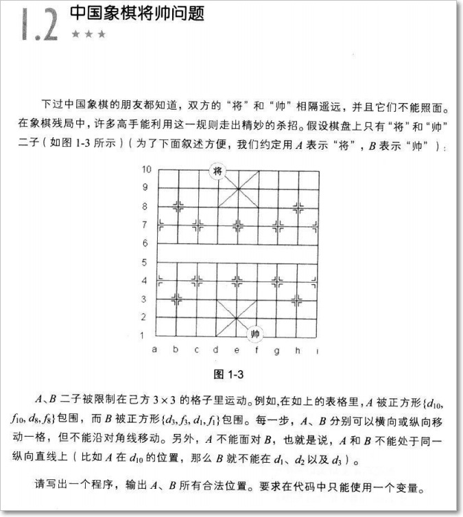
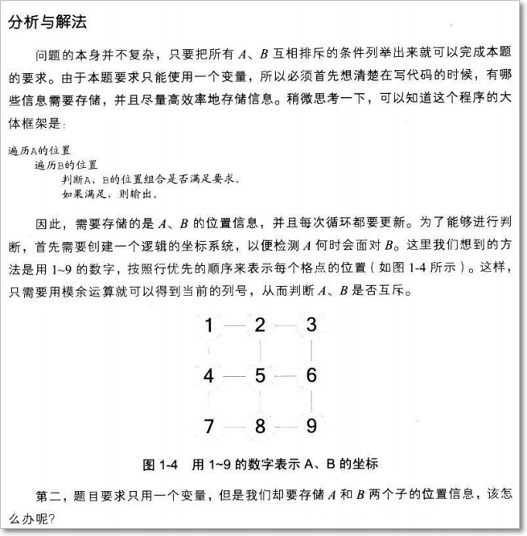
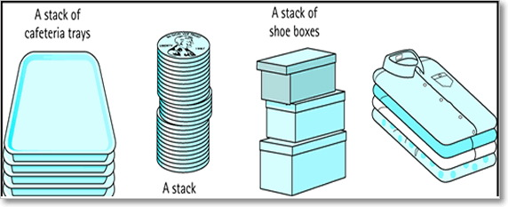
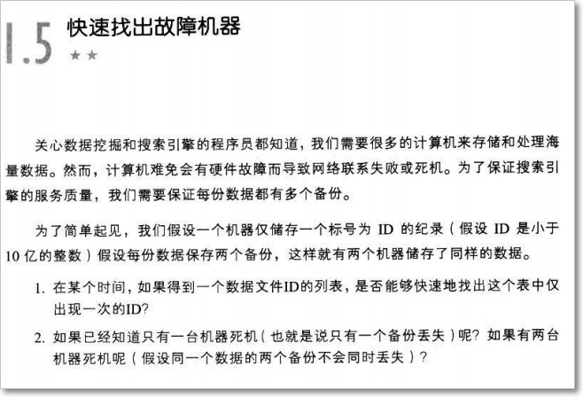

# ABAP_Algorithm_Demo
ABAP Implementation of Interesting Algorithm Tasks for Interviews

## Chinese Chess
> In Chinese chess game, the generals from 2 armies can stand face to face. So the task is: Build a model and only **ONE** variable to list all the possible position of 2 generals.

  
  

[Code](./src/zalgor_chinese_chess.prog.abap)

## Stack
> ***Stack*** is a very import data structure to represent the concept of ***FILO*** (First In Last Out). The knowledge of stack is also essential for you to understand recursion.

[Code](./src/zalgor_stack_4_table_cls.prog.abap)

## Quickly Find Out The Malfunctioned Machine
> Says we have lots of machines to backup important data on them, each data file is identified by the unique ID and ONE ID must be copied to TWO machines. Now if we have a detailed list of the proceeded File ID and the successfully copied machines, how can we find out if there's any malfunctioned machine that failed to be copied, in the most quickly way with least time and space consumption.

